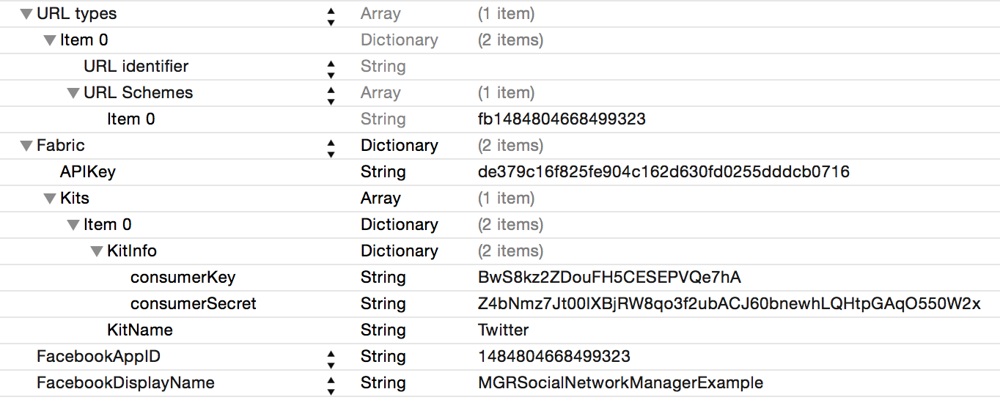
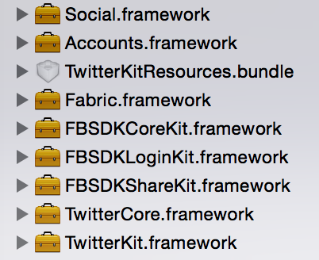

# MGREasyLogin
The manager for easy login in Facebook or Twitter

If you want to implement login via social network inside your app you can use this manager. You can easy get user profile of an account - token, user id, user name, photo, email, first name, last name.

How to install
--------

- Download and install Fabric (http://fabric.io/) and add Twitter SDK to iOS App.
- Create an app for Facebook (http://developers.facebook.com/apps). Don't forget set YES in the field '
Do you want to make this app and all its live features available to the general public?'
- Create an app for Twitter (http://apps.twitter.com/)
- Add the frameworks: Social.framework and Accounts.framework
- Add this code to AppDelegate:

```objective-c
#import "MGREasyLogin.h"

- (BOOL)application:(UIApplication *)application didFinishLaunchingWithOptions:(NSDictionary *)launchOptions {
    return [[MGREasyLoginManager sharedManager] application:application didFinishLaunchingWithOptions:launchOptions];
}

- (void)applicationDidBecomeActive:(UIApplication *)application {
    [MGREasyLoginManager activateApp];
}

- (BOOL)application:(UIApplication *)application openURL:(NSURL *)url sourceApplication:(NSString *)sourceApplication annotation:(id)annotation {
    return [[MGREasyLoginManager sharedManager] application:application openURL:url sourceApplication:sourceApplication annotation:annotation];
}
```

If you are followed the instructions your Info.plist should contains the fields: 



and your project has the files:



Pod
--------

Is not implemented

```

How to user
--------

Login in Facebook:
```objective-c
[[MGREasyLoginManager sharedManager] userWithNetworkType:MGREasyLoginNetworkTypeFacebook success:^(MGREasyLoginUser *user, MGREasyLoginCacheType cacheType) {

} failed:^(NSError *error) {

}];
```

Login in Twitter:
```objective-c
[[MGREasyLoginManager sharedManager] userWithNetworkType:MGREasyLoginNetworkTypeTwitter success:^(MGREasyLoginUser *user, MGREasyLoginCacheType cacheType) {

} failed:^(NSError *error) {

}];
```

Logout:
```objective-c
[[MGREasyLoginManager sharedManager] logoutAllWithSuccess:^{

} failed:^(NSError *error) {

}];
```

You can don't add the code as above. You can just add MGREasyLoginFacebookButton or MGREasyLoginTwitterButton to view controller and you will be auto login by tapping on.

```objective-c
// Example of facebook button
MGREasyLoginFacebookButton *login = [MGREasyLoginFacebookButton buttonWithType:UIButtonTypeCustom];
[login setFrame:CGRectMake(100, 100, 100, 40)];
[login setTitle:@"Login" forState:UIControlStateNormal];
[login setBackgroundColor:[UIColor redColor]];
[self.view addSubview:login];
```

Use notifications for control a status of login.

Facebook notifications:
```objective-c
[[NSNotificationCenter defaultCenter] addObserver:self
                                         selector:@selector(facebookLoginStart:)
                                             name:MGREasyLoginFacebookLoginStartNotification
                                           object:nil];

[[NSNotificationCenter defaultCenter] addObserver:self
                                         selector:@selector(facebookLoginSuccess:)
                                             name:MGREasyLoginFacebookLoginSuccessNotification
                                           object:nil];

[[NSNotificationCenter defaultCenter] addObserver:self
                                         selector:@selector(facebookLoginError:)
                                             name:MGREasyLoginFacebookLoginErrorNotification
                                           object:nil];
```

Twitter notifications:
```objective-c
[[NSNotificationCenter defaultCenter] addObserver:self
                                         selector:@selector(twitterLoginStart:)
                                             name:MGREasyLoginTwitterLoginStartNotification
                                           object:nil];

[[NSNotificationCenter defaultCenter] addObserver:self
                                         selector:@selector(twitterLoginSuccess:)
                                             name:MGREasyLoginTwitterLoginSuccessNotification
                                           object:nil];

[[NSNotificationCenter defaultCenter] addObserver:self
                                         selector:@selector(twitterLoginError:)
                                             name:MGREasyLoginTwitterLoginErrorNotification
                                           obje
```

Configuring the manager
--------

By default the manager use Facebook's permissions - email, public_profile. You can add other permissions:

```objective-c
[[MGREasyLoginManager sharedManager] setPermissions:@[@"email", @"public_profile", @"user_friends", @"user_likes"] forNetworkWithType:MGREasyLoginNetworkTypeFacebook];
```
